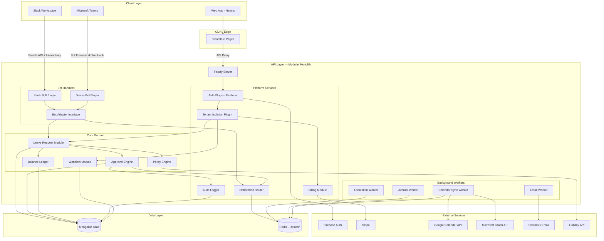
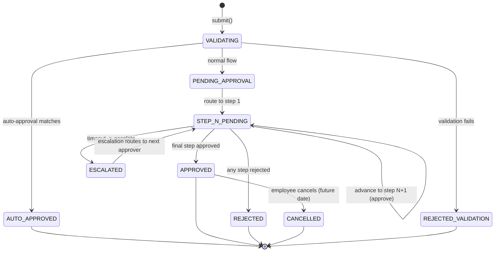

# Stage 1: Architecture — LeaveFlow

## Table of Contents

1. [Executive Summary](#executive-summary)
2. [Technology Stack](#technology-stack)
3. [System Architecture](#system-architecture)
4. [Multi-Tenancy Strategy](#multi-tenancy-strategy)
5. [Bot Platform Abstraction](#bot-platform-abstraction)
6. [Approval Engine Architecture](#approval-engine-architecture)
7. [Background Job Processing](#background-job-processing)
8. [Notification System](#notification-system)
9. [Integration Architecture](#integration-architecture)
10. [Security Architecture](#security-architecture)
11. [Data Architecture](#data-architecture)
12. [Infrastructure & DevOps](#infrastructure--devops)
13. [Non-Functional Requirements Mapping](#non-functional-requirements-mapping)
14. [Cost Estimates](#cost-estimates)

---

## Executive Summary

LeaveFlow is a greenfield multi-tenant SaaS product with three client surfaces: Slack bot, Teams bot, and web application. The architecture must support a 4-month MVP timeline with a small team (estimated 4 people), handle tenants ranging from 5 to 10,000+ employees, and remain cost-efficient while revenue is near zero.

The architecture follows a **modular monolith** pattern — a single deployable Node.js service with clearly separated internal modules. This avoids the operational overhead of microservices while maintaining clean boundaries that allow extraction later if needed. The web frontend is a standalone Next.js application. Data lives in MongoDB Atlas with Redis for job queues and caching.

Key architectural decisions:

- **Modular monolith** over microservices (speed, simplicity, small team)
- **Row-level tenant isolation** in shared MongoDB collections (cost, simplicity)
- **Finite state machine** for the approval engine (deterministic, auditable)
- **BullMQ + Redis** for background jobs (escalation timers, accrual, calendar sync)
- **Bot adapter pattern** abstracting Slack and Teams behind a common interface
- **Firebase Auth** with custom claims for multi-tenant RBAC
- **Next.js (React)** for the web application (SSR, ecosystem, hiring pool)

---

## Technology Stack

### Decision Summary

| Layer | Technology | Version | Rationale |
|-------|-----------|---------|-----------|
| **Runtime** | Node.js | 22 LTS | Non-blocking I/O for bot webhooks; largest ecosystem for Slack/Teams SDKs; team familiarity |
| **Language** | TypeScript | 5.x | Type safety across shared models; catches multi-tenant bugs at compile time |
| **API Framework** | Fastify | 5.x | 2-3x faster than Express; built-in schema validation (Ajv); plugin architecture maps to modules |
| **Web Frontend** | Next.js (React) | 15.x | SSR for dashboard SEO; App Router for layouts; massive component ecosystem; easier hiring than Angular for a startup |
| **State Management** | Zustand | 5.x | Lightweight, no boilerplate; sufficient for dashboard state; immutable update patterns built in |
| **UI Components** | shadcn/ui + Tailwind CSS | Latest | Copy-paste components (no dependency lock-in); Tailwind for rapid styling; accessible by default |
| **Database** | MongoDB Atlas | 8.x | Flexible schema for per-tenant policy configs; native JSON documents match leave request structure; Atlas handles ops |
| **ODM** | Mongoose | 8.x | Schema validation at app level; middleware hooks for tenant scoping; mature and well-documented |
| **Cache / Queues** | Redis (Upstash) | 7.x | BullMQ job queues; rate limiting counters; session cache; ephemeral data |
| **Job Queue** | BullMQ | 5.x | Delayed jobs for escalation timers; repeatable jobs for accrual cron; dead-letter queues; dashboard (Bull Board) |
| **Authentication** | Firebase Auth | Latest | Managed auth with email/password + OAuth; custom claims for tenant/role; free tier covers MVP scale |
| **Slack SDK** | @slack/bolt | 4.x | Official Slack SDK; handles Events API, Interactivity, Slash Commands; built-in retry and rate limiting |
| **Teams SDK** | botbuilder | 4.x | Microsoft Bot Framework SDK; Adaptive Cards; proactive messaging; official and supported |
| **Payments** | Stripe | Latest API | Per-seat billing; webhooks for lifecycle; Stripe Billing Portal for self-service; industry standard |
| **Email** | Postmark | Latest | Transactional email with high deliverability; template system; cost-effective for low volume |
| **Validation** | Zod | 3.x | Runtime + TypeScript type inference; shared between API and frontend; composes well |
| **Testing** | Vitest + Supertest + Playwright | Latest | Vitest for unit/integration (fast, native ESM); Supertest for API; Playwright for E2E |
| **Monorepo** | Turborepo | Latest | Shared packages (types, validation schemas); parallel builds; caching |

### Why Not Express?

Express is the default Node.js framework, but Fastify was chosen for three reasons:
1. **Performance**: Fastify handles 2-3x more requests per second, which matters for bot webhook endpoints receiving concurrent events from multiple tenants.
2. **Schema validation**: Built-in Ajv integration validates request/response schemas automatically, reducing manual validation code and improving API documentation.
3. **Plugin system**: Fastify's encapsulated plugin architecture naturally maps to our modular monolith — each domain module registers as a plugin with its own routes, decorators, and hooks.

Express remains a viable fallback if the team hits Fastify expertise issues. The migration cost would be moderate (route handlers are similar).

### Why Not Angular?

The discovery phase references Angular in the EdgeFrame stack. For LeaveFlow as a separate product:
1. **Hiring**: React developers outnumber Angular developers roughly 3:1 in the job market. For a startup that needs to hire quickly, this matters.
2. **Ecosystem**: The HR dashboard needs calendar components, drag-and-drop workflow builders (Phase 2), and charting libraries. React's ecosystem is deeper.
3. **Next.js**: Server-side rendering for the marketing pages and dashboard improves SEO and initial load performance. Angular Universal exists but has less community adoption.
4. **Speed**: React with shadcn/ui enables faster UI development for a small team than Angular's more structured approach.

### Monorepo Structure

```
leaveflow/
├── apps/
│   ├── api/                    # Fastify API server
│   │   ├── src/
│   │   │   ├── modules/        # Domain modules (see below)
│   │   │   ├── plugins/        # Fastify plugins (auth, tenant, etc.)
│   │   │   ├── middleware/     # Cross-cutting middleware
│   │   │   ├── workers/        # BullMQ job processors
│   │   │   └── server.ts       # Entry point
│   │   └── package.json
│   ├── web/                    # Next.js web application
│   │   ├── src/
│   │   │   ├── app/            # App Router pages
│   │   │   ├── components/     # UI components
│   │   │   ├── hooks/          # React hooks
│   │   │   └── stores/         # Zustand stores
│   │   └── package.json
│   └── docs/                   # API documentation (optional)
├── packages/
│   ├── shared-types/           # TypeScript interfaces shared across apps
│   ├── validation/             # Zod schemas shared across apps
│   ├── bot-messages/           # Bot message templates (Block Kit + Adaptive Cards)
│   └── constants/              # Enums, config constants
├── turbo.json
├── package.json
└── docker-compose.yml          # Local dev (MongoDB + Redis)
```

### API Module Structure

```
api/src/modules/
├── tenant/                     # Tenant CRUD, settings, onboarding
├── auth/                       # Firebase token verification, role checks
├── employee/                   # Employee CRUD, CSV import, team assignment
├── team/                       # Team CRUD, workflow assignment
├── leave-type/                 # Leave type configuration
├── leave-policy/               # Accrual, carryover, blackout rules
├── leave-request/              # Request CRUD, validation, lifecycle
├── approval-engine/            # State machine, step routing, escalation
├── workflow/                   # Workflow definition CRUD, templates
├── balance/                    # Balance ledger, accrual calculations
├── holiday/                    # Public holiday data, company holidays
├── notification/               # Notification router (Slack/Teams/Email)
├── bot-slack/                  # Slack Bolt handlers
├── bot-teams/                  # Teams Bot Framework handlers
├── bot-adapter/                # Shared bot abstraction layer
├── calendar-sync/              # Google Calendar + Outlook integration
├── billing/                    # Stripe integration, plan enforcement
├── audit/                      # Audit log service
└── health/                     # Health checks, readiness probes
```

Each module follows the same internal structure:

```
module-name/
├── module-name.routes.ts       # Fastify route definitions
├── module-name.service.ts      # Business logic
├── module-name.repository.ts   # Data access (Mongoose)
├── module-name.schema.ts       # Zod validation schemas
├── module-name.types.ts        # Module-specific types
├── module-name.test.ts         # Unit tests
└── index.ts                    # Public exports
```

---

## System Architecture

### High-Level System Diagram



### Component Responsibilities

| Component | Responsibility | Communication |
|-----------|---------------|---------------|
| **Fastify Server** | HTTP server, route registration, plugin loading, request lifecycle | Receives all HTTP requests; delegates to plugins |
| **Auth Plugin** | Verify Firebase JWT, extract tenant ID and role from custom claims | Decorates request with `req.auth = { tenantId, userId, role }` |
| **Tenant Isolation Plugin** | Inject tenant filter into all DB queries; block cross-tenant access | Fastify hook that runs after auth; sets `req.tenantScope` |
| **Slack Bolt Plugin** | Handle Slack Events API, slash commands, interactive messages | Receives Slack webhooks; calls Bot Adapter |
| **Teams Bot Plugin** | Handle Teams Bot Framework activities, Adaptive Card actions | Receives Teams webhooks; calls Bot Adapter |
| **Bot Adapter** | Abstract platform-specific bot operations behind a common interface | Called by core modules for sending messages; delegates to Slack or Teams |
| **Leave Request Module** | Request lifecycle: create, validate, cancel; query requests | Calls Policy Engine for validation, Approval Engine for routing |
| **Approval Engine** | Finite state machine for request approval flow; step transitions | Reads workflow definition; advances state; emits events to Notification Router |
| **Policy Engine** | Validate requests against leave policies (balance, blackout, coverage, working days) | Pure validation service; reads policy config from DB |
| **Balance Ledger** | Append-only ledger for balance changes; calculate current balance | Write-only for mutations; read for balance queries |
| **Workflow Module** | CRUD for workflow definitions; template management | Stores workflow configs; provides snapshots for Approval Engine |
| **Notification Router** | Route notifications to appropriate channel (Slack DM, Teams message, email) | Enqueues jobs in BullMQ; workers handle delivery |
| **Audit Logger** | Append-only log of all state-changing operations | Write-only service; called by other modules after state changes |
| **Billing Module** | Stripe integration; plan enforcement; usage tracking | Stripe webhooks for billing events; middleware for plan limit checks |
| **Escalation Worker** | Poll overdue approval steps; trigger escalation or reminders | BullMQ repeatable job; reads pending requests; calls Approval Engine |
| **Accrual Worker** | Monthly balance accrual calculations | BullMQ repeatable job; reads policies; writes to Balance Ledger |
| **Calendar Sync Worker** | Create/delete OOO events on Google Calendar and Outlook | BullMQ job; processes approval/cancellation events; calls Calendar APIs |
| **Email Worker** | Send transactional emails via Postmark | BullMQ job; renders email templates; calls Postmark API |

---

## Multi-Tenancy Strategy

### Decision: Row-Level Isolation in Shared Collections

**Chosen approach**: All tenants share the same MongoDB collections. Every document includes a `tenantId` field. All queries are scoped by `tenantId` via middleware.

**Why not schema-per-tenant (separate databases)?**
- MongoDB Atlas charges per cluster, not per database. However, managing hundreds of separate databases creates operational complexity (migrations, backups, connection pooling).
- At MVP scale (target: 200 companies in 6 months), the overhead of per-tenant databases is unjustifiable.
- Row-level isolation with proper indexing handles the 5-to-10,000-employee range without architectural changes.

**Why not schema-per-tenant within one database?**
- MongoDB does not have a native schema isolation mechanism like PostgreSQL's `SET search_path`. Separate collections per tenant (e.g., `tenant_abc_leave_requests`) create N*M collections, making aggregation queries and migrations extremely painful.

### Tenant Isolation Implementation

```
1. Every Mongoose model includes: { tenantId: { type: String, required: true, index: true } }
2. A Fastify plugin (`tenantPlugin`) runs after auth on every request:
   - Extracts tenantId from the authenticated user's Firebase custom claims
   - Attaches tenantId to the request context
3. Every repository method receives tenantId as a required parameter
   - Repository methods ALWAYS include tenantId in query filters
   - No repository method accepts a "find all across tenants" query
4. Compound indexes: every query-heavy collection has (tenantId, <query fields>) compound indexes
5. Integration tests: a test suite specifically verifies that tenant A cannot access tenant B's data
```

### Index Strategy for Multi-Tenant Queries

| Collection | Primary Compound Index | Secondary Indexes |
|------------|----------------------|-------------------|
| `leave_requests` | `{ tenantId, status, createdAt }` | `{ tenantId, employeeId, status }`, `{ tenantId, currentApproverId }` |
| `employees` | `{ tenantId, email }` (unique) | `{ tenantId, teamId }`, `{ tenantId, slackUserId }`, `{ tenantId, teamsUserId }` |
| `teams` | `{ tenantId, name }` | `{ tenantId, workflowId }` |
| `workflows` | `{ tenantId, _id }` | None needed at MVP scale |
| `balance_ledger` | `{ tenantId, employeeId, leaveTypeId, effectiveDate }` | None |
| `audit_log` | `{ tenantId, timestamp }` | `{ tenantId, entityType, entityId }` |
| `bot_mappings` | `{ tenantId, platform, platformUserId }` (unique) | None |

---

## Bot Platform Abstraction

### The BotAdapter Pattern

Slack and Teams have fundamentally different APIs. Without abstraction, every feature requires parallel implementation. The BotAdapter pattern centralizes the difference.

```
                    +-----------------------+
                    |   Core Business Logic |
                    |  (Leave Request Svc,  |
                    |   Approval Engine,    |
                    |   Notification Router)|
                    +-----------+-----------+
                                |
                    +-----------v-----------+
                    |     BotAdapter         |
                    |     (Interface)        |
                    +-----+-----+-----------+
                          |     |
                +---------+     +---------+
                |                         |
    +-----------v-----------+ +-----------v-----------+
    |   SlackBotAdapter     | |   TeamsBotAdapter     |
    |                       | |                       |
    | - Block Kit modals    | | - Adaptive Cards      |
    | - Slack Bolt handlers | | - Bot Framework       |
    | - Slash commands      | | - Message extensions  |
    | - chat.postMessage    | | - Proactive messaging |
    +-----------------------+ +-----------------------+
```

### BotAdapter Interface

The interface defines platform-agnostic operations:

```typescript
interface BotAdapter {
  // Send a leave request form to the user
  sendLeaveRequestForm(userId: string, context: LeaveFormContext): Promise<void>;

  // Send an approval card to an approver
  sendApprovalCard(approverId: string, request: LeaveRequestSummary): Promise<void>;

  // Update an existing approval card (e.g., after action or cancellation)
  updateApprovalCard(messageRef: MessageReference, update: CardUpdate): Promise<void>;

  // Send a direct message notification
  sendDirectMessage(userId: string, message: NotificationPayload): Promise<void>;

  // Post to a team/channel
  postToChannel(channelRef: ChannelReference, message: NotificationPayload): Promise<void>;

  // Resolve platform user ID to LeaveFlow employee
  resolveUser(platformUserId: string, platformTenantId: string): Promise<Employee | null>;
}
```

### Platform-Specific Concerns

| Concern | Slack | Teams |
|---------|-------|-------|
| **Forms** | Block Kit Modals (via `views.open`) | Adaptive Cards (via `Activity`) |
| **Interactive buttons** | Block Kit `actions` with `action_id` | Adaptive Card `Action.Execute` |
| **Proactive messages** | `chat.postMessage` with bot token | Requires stored `ConversationReference` |
| **User identification** | `slackUserId` + `slackTeamId` | `teamsUserId` + `tenantId` from AAD |
| **Rate limits** | Tier-based (1-4 per method) | Per-app throttling by Graph API |
| **Message updates** | `chat.update` with `ts` | `updateActivity` with `activityId` |

### Message Template System

Bot messages are defined as platform-agnostic templates in the `packages/bot-messages` package:

```typescript
// Platform-agnostic message definition
interface LeaveApprovalMessage {
  requesterName: string;
  leaveType: string;
  startDate: string;
  endDate: string;
  workingDays: number;
  reason?: string;
  approvalChainPosition: string; // e.g., "Step 2 of 3"
}

// Each adapter converts to platform-specific format:
// SlackBotAdapter -> Block Kit JSON
// TeamsBotAdapter -> Adaptive Card JSON
```

---

## Approval Engine Architecture

### Decision: Finite State Machine

The approval engine is a deterministic finite state machine (FSM). Each leave request has a `status` and a `currentStep` that together define its state. Transitions are explicit and auditable.

**Why FSM over event-driven workflow engine?**
- MVP approval flows are sequential (1-N steps). An FSM handles this naturally.
- Every state transition is a single, auditable operation.
- No need for a separate workflow engine (Temporal, Conductor) — that is Phase 2 complexity for conditional/parallel flows.
- FSM is easy to test: enumerate states, enumerate transitions, verify all paths.

### State Diagram



### Request State Model

```typescript
interface LeaveRequest {
  _id: ObjectId;
  tenantId: string;
  employeeId: string;
  leaveTypeId: string;
  startDate: Date;
  endDate: Date;
  halfDayStart: boolean;  // first day is half-day
  halfDayEnd: boolean;    // last day is half-day
  workingDays: number;    // calculated, excludes weekends/holidays
  reason?: string;
  status: LeaveRequestStatus;
  workflowSnapshot: WorkflowDefinition;  // frozen at submission time (BR-102)
  currentStep: number;                    // 0-indexed into workflow steps
  approvalHistory: ApprovalAction[];      // audit trail within the request
  createdAt: Date;
  updatedAt: Date;
}

type LeaveRequestStatus =
  | 'pending_validation'
  | 'pending_approval'
  | 'approved'
  | 'auto_approved'
  | 'rejected'
  | 'cancelled'
  | 'validation_failed';

interface ApprovalAction {
  step: number;
  approverId: string;
  action: 'approved' | 'rejected' | 'escalated' | 'skipped';
  reason?: string;           // mandatory for rejection
  delegatedFrom?: string;    // if delegation was active
  timestamp: Date;
}
```

### Approval Engine Service

The engine exposes three operations:

1. **`submitRequest(request)`** — Validate via Policy Engine; if valid, snapshot workflow, check auto-approval rules, then either auto-approve or route to step 0.
2. **`processAction(requestId, approverId, action, reason?)`** — Validate the action (idempotency, not cancelled, correct step); advance or reject; trigger notifications.
3. **`processEscalation(requestId)`** — Called by Escalation Worker; advance to next step or send reminder per workflow config.

Each operation:
- Loads the request and workflow snapshot
- Validates preconditions (BR-020 through BR-033)
- Performs the state transition
- Writes audit log entry
- Emits notification events

### Workflow Definition Schema

```typescript
interface WorkflowDefinition {
  _id: ObjectId;
  tenantId: string;
  name: string;
  steps: WorkflowStep[];
  isTemplate: boolean;
  createdAt: Date;
  updatedAt: Date;
  version: number;
}

interface WorkflowStep {
  order: number;
  approverType: 'specific_user' | 'role_direct_manager' | 'role_team_lead' | 'role_hr';
  approverUserId?: string;       // for specific_user
  timeoutHours: number;          // default 48
  escalationMode: 'escalate_next' | 'remind' | 'none';
  maxReminders: number;          // default 3
}
```

---

## Background Job Processing

### Decision: BullMQ + Redis

BullMQ provides reliable job queues with features critical for LeaveFlow:
- **Delayed jobs**: Schedule escalation checks at specific times (step timeout).
- **Repeatable jobs**: Monthly accrual runs, 15-minute escalation scans.
- **Retry with backoff**: Calendar sync and email delivery with exponential retry.
- **Dead-letter queues**: Failed jobs are preserved for debugging, not lost.
- **Dashboard**: Bull Board provides visibility into job queues for ops.

### Job Queues

| Queue | Job Type | Schedule / Trigger | Retry Policy |
|-------|----------|-------------------|--------------|
| `escalation` | Check overdue approval steps | Every 15 minutes (repeatable) | 3 retries, 1-minute backoff |
| `accrual` | Calculate monthly balance accruals | Monthly on configured day (repeatable) | 3 retries, 5-minute backoff |
| `notification` | Send Slack/Teams/Email notifications | Event-driven (on approval, rejection, etc.) | 5 retries, exponential backoff (1s, 5s, 30s, 2m, 10m) |
| `calendar-sync` | Create/delete OOO calendar events | Event-driven (on approval/cancellation) | 5 retries, exponential backoff |
| `csv-import` | Process bulk CSV employee imports | On-demand (user uploads CSV) | No retry (report errors to user) |

### Escalation Worker Detail

```
Every 15 minutes:
1. Query: leave_requests WHERE status = 'pending_approval'
   AND approvalHistory[currentStep].timestamp + workflow.steps[currentStep].timeoutHours < NOW
2. For each overdue request:
   a. If escalationMode = 'remind' AND reminders < maxReminders:
      - Send reminder notification to current approver
      - Increment reminder counter
   b. If escalationMode = 'remind' AND reminders >= maxReminders:
      - Notify HR Admin of stuck request
   c. If escalationMode = 'escalate_next' AND next step exists:
      - Skip current step (action = 'escalated')
      - Advance to next step
      - Notify current approver, next approver, employee, HR
   d. If escalationMode = 'escalate_next' AND no next step:
      - Send reminder to current approver
      - Notify HR Admin
   e. Write audit log for every escalation action
```

### Accrual Worker Detail

```
Monthly (configurable day per tenant):
1. Query all active tenants
2. For each tenant, query employees with accrual-based leave types
3. For each employee + leave type:
   a. Check accrual rule (monthly, quarterly, custom)
   b. Skip if not due (quarterly accrual checked only on quarter boundary)
   c. Calculate accrual amount (pro-rated for mid-year hires per BR-043)
   d. Append balance ledger entry: { type: 'accrual', amount, date }
4. Log completion in audit (tenant-level summary, not per-employee)
```

---

## Notification System

### Notification Router Architecture

```
Event Source (Approval Engine, Policy Engine, etc.)
        |
        v
  NotificationRouter.emit(event)
        |
        v
  Determine recipients + channels
        |
        +---> BullMQ 'notification' queue
                |
                +---> SlackNotificationWorker
                |         |
                |         +--> SlackBotAdapter.sendDirectMessage()
                |         +--> SlackBotAdapter.postToChannel()
                |
                +---> TeamsNotificationWorker
                |         |
                |         +--> TeamsBotAdapter.sendDirectMessage()
                |         +--> TeamsBotAdapter.postToChannel()
                |
                +---> EmailNotificationWorker
                          |
                          +--> Postmark.sendEmail()
```

### Notification Events

| Event | Recipients | Channel Priority |
|-------|-----------|-----------------|
| `request.submitted` | Requester, Step-1 Approver | Bot DM (primary platform) |
| `request.approved_step` | Requester, Next Approver | Bot DM |
| `request.approved_final` | Requester, Team Channel | Bot DM + Channel post |
| `request.rejected` | Requester | Bot DM |
| `request.cancelled` | All previous approvers | Bot DM |
| `request.escalated` | Original approver, Next approver, HR | Bot DM |
| `request.reminder` | Current approver | Bot DM |
| `billing.payment_failed` | Company Admin | Email |
| `billing.plan_changed` | Company Admin | Email |

### Platform Selection Logic

Each employee has a `primaryPlatform` field (`slack` | `teams` | `email`). Default: the platform where they first interacted with the bot.

1. Try primary platform
2. If delivery fails (user not found on platform, token expired), try the other bot platform
3. If both bot platforms fail, fall back to email
4. If no email configured, log a delivery failure and alert HR Admin

---

## Integration Architecture

### Slack Integration

**Installation Flow:**
1. Company Admin clicks "Add to Slack" on LeaveFlow web app
2. OAuth 2.0 flow with scopes: `commands`, `chat:write`, `im:write`, `users:read`, `users:read.email`
3. LeaveFlow stores: `botToken`, `teamId`, `botUserId` per tenant
4. Slack Bolt app registers: slash commands (`/leave`), interactive endpoints, event subscriptions

**Webhook Endpoints:**
- `POST /api/slack/events` — Slack Events API (url_verification, message events)
- `POST /api/slack/interactions` — Interactive messages (button clicks, modal submissions)
- `POST /api/slack/commands` — Slash commands (`/leave`, `/leave balance`, `/leave status`)

**Rate Limit Handling:**
- Outbound Slack API calls go through a per-tenant rate limiter
- Uses a token bucket algorithm in Redis (separate bucket per Slack workspace)
- Slack Bolt SDK handles 429 responses with built-in retry

### Teams Integration

**Installation Flow:**
1. Company Admin clicks "Add to Teams" on LeaveFlow web app
2. Microsoft OAuth flow with scopes: `openid`, `profile`, `User.Read`, `ChannelMessage.Send`
3. Bot is registered in Azure Bot Service
4. On first user interaction, store `ConversationReference` for proactive messaging

**Webhook Endpoints:**
- `POST /api/teams/messages` — Bot Framework messaging endpoint
- `POST /api/teams/activities` — Activity handler for card actions

**Proactive Messaging:**
- Teams requires a stored `ConversationReference` to send proactive messages
- Store reference on every user's first bot interaction
- If reference is missing, cannot send notifications (fall back to email)

### Calendar Integration

**Google Calendar:**
- OAuth 2.0 with scope: `https://www.googleapis.com/auth/calendar.events`
- Per-employee OAuth consent (they authorize their own calendar)
- On approval: create all-day OOO event via Calendar API v3
- On cancellation: delete the event using stored `eventId`
- Token refresh handled by Google Auth Library

**Microsoft Outlook:**
- Uses Microsoft Graph API with scope: `Calendars.ReadWrite`
- Same OAuth flow as Teams (can share the consent)
- On approval: `POST /me/events` with `isAllDay: true`, `showAs: 'oof'`
- On cancellation: `DELETE /me/events/{id}`

### Stripe Integration

**Billing Model:**
- Stripe Products: Free, Team ($2/user/mo), Business ($4/user/mo)
- Stripe Prices: Per-seat, metered billing
- Stripe Subscriptions: One subscription per tenant with `quantity` = active employee count

**Integration Points:**
- `POST /api/billing/checkout` — Create Stripe Checkout Session for upgrade
- `POST /api/billing/portal` — Create Stripe Billing Portal session for self-service
- `POST /api/webhooks/stripe` — Stripe webhooks for: `invoice.paid`, `invoice.payment_failed`, `customer.subscription.updated`, `customer.subscription.deleted`

**Seat Count Sync:**
- When employees are added/removed, update Stripe subscription quantity
- Proration handled by Stripe (BR-087)
- Grace period on payment failure: 7 days before downgrade (BR-085)

### Webhook System (Phase 2+)

Not in MVP scope but the architecture accommodates it:
- Events already flow through the NotificationRouter
- Adding a `WebhookWorker` that posts to customer-configured URLs is straightforward
- Event schema is defined from day 1 to ensure backward compatibility

---

## Security Architecture

### Authentication Flow

**Web Application:**
1. User registers/logs in via Firebase Auth (email/password at MVP; Google/Microsoft OAuth at Phase 2)
2. Firebase returns a JWT with custom claims: `{ tenantId, role, employeeId }`
3. Every API request includes `Authorization: Bearer <firebase-jwt>`
4. Fastify auth plugin verifies JWT with Firebase Admin SDK
5. Tenant ID and role extracted from custom claims

**Bot Users:**
1. Slack/Teams bot interactions do not go through Firebase Auth
2. Bot identifies users by platform user ID (`slackUserId` or `teamsUserId`)
3. Bot handler looks up platform user ID in `bot_mappings` collection to find employee and tenant
4. If no mapping exists, bot responds: "I could not find your account. Contact your HR admin."
5. Bot requests to the API use an internal service authentication (shared secret, not exposed externally)

**Bot-to-API Authentication:**
- Bot handlers run in the same process as the API (monolith), so no external auth is needed
- Bot handlers call service methods directly, passing the resolved `tenantId` and `employeeId`
- This avoids the complexity of a service-to-service auth scheme while maintaining tenant isolation

### Authorization Model (RBAC)

| Role | Scope | Permissions |
|------|-------|-------------|
| `company_admin` | Tenant-wide | All operations; billing; user management; bot installation |
| `hr_admin` | Tenant-wide | Leave policies; workflows; all employee data; force approve/reject; reports |
| `manager` | Team-scoped | View team calendar; approve/reject for their team; view team balances |
| `employee` | Self-scoped | Submit/cancel own requests; view own balance/history; view team absence calendar (limited) |

**Implementation:**
- Roles stored as Firebase Auth custom claims: `{ role: 'hr_admin', tenantId: 'abc123' }`
- Route-level guards check minimum required role
- Resource-level guards check ownership (e.g., employee can only cancel their own request)
- Manager scope: manager can only see/approve requests for employees in their team(s)

### Data Isolation

1. **Tenant isolation**: Every query includes `tenantId` filter (enforced by repository layer, tested by integration tests)
2. **Employee privacy**: Team calendar shows only name + absence dates, not leave type (BR-092)
3. **Encrypted secrets**: Bot tokens, OAuth tokens encrypted at rest using AES-256 with a per-tenant key derived from a master key stored in environment variables
4. **PII minimization**: Audit log references employee IDs, not names; names resolved at display time

### GDPR Compliance

| Right | Implementation |
|-------|---------------|
| **Right to access** | API endpoint: `GET /employees/me/data-export` returns all personal data as JSON |
| **Right to rectification** | Standard profile update endpoints |
| **Right to erasure** | Pseudonymization: replace employee name/email with hash in all collections; delete bot mappings; revoke OAuth tokens; retain anonymized audit log entries (BR-100 compatibility) |
| **Right to portability** | Data export endpoint returns structured JSON |
| **Data processing agreement** | Required for each tenant; displayed during onboarding |

### API Security

| Measure | Implementation |
|---------|---------------|
| **Rate limiting** | Redis-based token bucket; per-tenant limits (100 req/min free, 500 req/min paid) |
| **Input validation** | Zod schemas on every route; Fastify Ajv for JSON schema validation |
| **CORS** | Allow only the LeaveFlow web app domain; no wildcard origins |
| **Helmet** | HTTP security headers (CSP, HSTS, X-Frame-Options) via `@fastify/helmet` |
| **Request size** | Max 1MB request body (sufficient for CSV uploads via presigned URL pattern) |
| **SQL injection** | N/A (MongoDB); Mongoose parameterizes all queries |
| **NoSQL injection** | Zod validates that query parameters are strings, not objects; no `$where` or `$expr` on user input |
| **HTTPS** | TLS termination at Railway/Cloudflare; no plaintext in transit |
| **Dependency audit** | `npm audit` in CI; Dependabot for automated PRs |

---

## Data Architecture

### Collections

| Collection | Description | Key Fields | Estimated Size (200 tenants) |
|------------|-------------|------------|------------------------------|
| `tenants` | Company profiles, settings, billing | name, slug, settings, plan, stripeCustomerId | 200 docs |
| `employees` | Employee records per tenant | tenantId, email, name, role, teamId, startDate | ~20,000 docs |
| `teams` | Team definitions per tenant | tenantId, name, workflowId, managerId | ~2,000 docs |
| `workflows` | Approval workflow definitions | tenantId, name, steps[], version | ~1,000 docs |
| `leave_types` | Leave type configurations per tenant | tenantId, name, accrualRule, carryoverRule | ~1,000 docs |
| `leave_requests` | Leave request records | tenantId, employeeId, status, currentStep, workflowSnapshot | ~100,000 docs/year |
| `balance_ledger` | Append-only balance changes | tenantId, employeeId, leaveTypeId, type, amount, date | ~500,000 entries/year |
| `audit_log` | Immutable audit trail | tenantId, actorId, action, entityType, entityId, timestamp | ~1M entries/year |
| `bot_mappings` | Platform user ID to employee mapping | tenantId, platform, platformUserId, employeeId | ~20,000 docs |
| `holiday_calendars` | Public holiday data (shared + custom) | countryCode, year, holidays[] | ~250 docs (50 countries * 5 years) |
| `oauth_tokens` | Encrypted OAuth tokens (calendar, bot) | tenantId, service, encryptedToken, expiresAt | ~20,000 docs |
| `delegations` | Approval delegation records | tenantId, delegatorId, delegateId, startDate, endDate | ~500 docs |

### Data Retention

| Data | Retention | Rationale |
|------|-----------|-----------|
| Active tenant data | Indefinite while subscribed | Core product data |
| Leave requests | 5 years after creation | Compliance; labor law |
| Audit log | 7 years | SOC 2 compliance target |
| Balance ledger | 5 years | Matches leave request retention |
| OAuth tokens | Until revoked or employee removed | Access control |
| Bot mappings | Until employee removed + 30 days | Grace period for re-onboarding |
| Deleted tenant data | 90 days in soft-delete, then purged | Allow recovery; GDPR requires eventual deletion |

### Caching Strategy

| Data | Cache Location | TTL | Invalidation |
|------|---------------|-----|-------------|
| Employee context (for bot commands) | Redis | 5 minutes | On employee update |
| Leave type definitions | Redis | 15 minutes | On leave type update |
| Holiday calendar (per country/year) | Redis | 24 hours | Manual refresh |
| Tenant settings | Redis | 10 minutes | On settings update |
| Balance summary (per employee) | Not cached | N/A | Always computed from ledger |

Balance is not cached because it must reflect the latest ledger state for accurate validation. The ledger query (sum of entries per employee per leave type) is fast with the compound index.

---

## Infrastructure & DevOps

### Hosting

| Component | Host | Rationale |
|-----------|------|-----------|
| API server | Railway | Simple container deployment; auto-scaling; built-in Redis add-on; ~$5/month at MVP scale |
| Web app (Next.js) | Vercel | Native Next.js hosting; edge functions; free tier covers MVP; CDN included |
| MongoDB | MongoDB Atlas (M10) | Managed; auto-scaling; built-in backups; free tier for dev, M10 (~$57/mo) for production |
| Redis | Upstash | Serverless Redis; pay-per-request; BullMQ compatible; free tier for dev |
| DNS + CDN | Cloudflare | Free tier; DDoS protection; SSL termination |

### Environment Strategy

| Environment | Purpose | Database | Infrastructure |
|-------------|---------|----------|---------------|
| `local` | Developer machines | Docker Compose (MongoDB + Redis) | None |
| `staging` | Pre-production testing | MongoDB Atlas (M0 free) + Upstash free | Railway (staging service) + Vercel preview |
| `production` | Live product | MongoDB Atlas (M10) + Upstash Pro | Railway (production service) + Vercel production |

Firebase Auth: separate projects for staging and production (per EdgeFrame convention).

### CI/CD Pipeline

```
GitHub Actions:

on push to feature/*:
  1. Lint (ESLint + Prettier)
  2. Type check (tsc --noEmit)
  3. Unit tests (Vitest)
  4. Integration tests (Vitest + MongoDB Memory Server)
  5. Build check (Turborepo build)

on PR to develop:
  6. All above +
  7. E2E tests (Playwright against staging)
  8. Dependency audit (npm audit)
  9. Deploy preview to Vercel

on merge to develop:
  10. Deploy to staging (Railway + Vercel)
  11. Run smoke tests against staging

on merge to main:
  12. Deploy to production (Railway + Vercel)
  13. Run smoke tests against production
  14. Notify Slack channel
```

### Monitoring & Observability

| Concern | Tool | Rationale |
|---------|------|-----------|
| **APM / Tracing** | Sentry | Error tracking + performance monitoring; generous free tier; integrates with Node.js and React |
| **Logging** | Pino (structured JSON) → Railway logs | Pino is Fastify's native logger; Railway provides log aggregation; search via Railway dashboard |
| **Uptime monitoring** | Better Uptime (free tier) | External health check every 1 minute; alerting via Slack |
| **Job queue dashboard** | Bull Board | Built-in BullMQ UI for job inspection; mounted at `/admin/queues` (auth-protected) |
| **Metrics** | Sentry Performance | Request latency, error rates, throughput; sufficient for MVP |

**Key Alerts:**
- API error rate > 1% in 5 minutes
- Bot response time p95 > 2 seconds
- Job queue depth > 100 (notification backlog)
- Escalation worker failure
- Stripe webhook processing failure
- MongoDB connection pool exhaustion

### Cost Estimates (Monthly, MVP Scale)

| Service | Tier | Estimated Cost |
|---------|------|---------------|
| Railway (API) | Pro | $5 - $20 |
| Vercel (Web) | Pro | $0 - $20 |
| MongoDB Atlas | M10 | $57 |
| Upstash Redis | Pay-as-you-go | $0 - $10 |
| Firebase Auth | Free tier (50K MAU) | $0 |
| Sentry | Free tier | $0 |
| Postmark | Free tier (100 emails/mo) | $0 - $10 |
| Cloudflare | Free tier | $0 |
| Better Uptime | Free tier | $0 |
| Domain + misc | — | $15 |
| **Total** | | **$77 - $132/month** |

At 200 companies with average 50 employees, most on free tier, estimated 30 paid (Team plan at $2/user * ~30 users avg):
- **Revenue estimate**: 30 companies * 30 users * $2 = $1,800/month
- **Infrastructure cost**: ~$100/month
- **Gross margin**: ~94%

---

## Non-Functional Requirements Mapping

| NFR | Target | Architecture Approach |
|-----|--------|----------------------|
| NFR-1: Bot response < 2s | p95 < 2s | Ack-then-process pattern: bot handler acknowledges immediately, heavy processing (validation, DB writes) happens async. Slack Bolt's `ack()` returns to Slack within 3s deadline. |
| NFR-2: 99.9% uptime | 8.7 hours downtime/year | Railway auto-restart; MongoDB Atlas auto-failover; Redis Upstash serverless (no downtime on scaling); health check endpoint for load balancer |
| NFR-3: SOC 2 / GDPR | Compliance ready | Immutable audit log; encrypted PII; data access logging; GDPR erasure via pseudonymization; data retention policies |
| NFR-4: 5-10,000 employees | No rewrite needed | Row-level tenancy with compound indexes; pagination on all list endpoints; BullMQ handles async load; MongoDB Atlas auto-scales storage |
| NFR-5: Multi-tenancy | Complete isolation | Every query scoped by tenantId; integration tests verify isolation; no cross-tenant aggregation queries |
| NFR-6: Accessibility | WCAG 2.1 AA | shadcn/ui components are accessible by default; Radix UI primitives handle ARIA; bot messages are text-based (inherently accessible) |
| NFR-7: Localization | English MVP; i18n-ready | All user-facing strings use i18n keys from day 1 (`t('key')`); no hardcoded strings; translation files added in Phase 2 |
| NFR-9: Immutable audit | Append-only log | MongoDB collection with no update/delete operations; Mongoose middleware prevents mutation; API has no PUT/DELETE routes for audit collection |

---

## Scaling Strategy (When Needed)

The modular monolith is designed to be split when necessary. Here is the scaling playbook:

**Phase 1 (MVP, 0-500 tenants):** Single monolith on Railway. Single MongoDB Atlas cluster. Upstash Redis.

**Phase 2 (500-2,000 tenants):**
- Separate the BullMQ workers into a dedicated Railway service (workers can scale independently of the API)
- Upgrade MongoDB Atlas to M30 (dedicated cluster)
- Add read replicas for reporting queries (HR dashboard)

**Phase 3 (2,000+ tenants):**
- Extract the bot handlers into a separate service (high-throughput webhook receiver)
- Extract the notification router into a separate service
- Consider dedicated Redis for job queues vs. caching
- Evaluate regional deployment for data residency

The key principle: optimize for the current scale, not the imagined future scale. The modular structure makes extraction safe when the need arises.

---

## Decisions Log

| Decision | Chosen | Rejected Alternatives | Rationale |
|----------|--------|----------------------|-----------|
| Architecture style | Modular monolith | Microservices, serverless | 4-person team; 4-month timeline; operational simplicity |
| API framework | Fastify | Express, NestJS | Performance; native validation; plugin system maps to modules |
| Frontend | Next.js (React) | Angular, SvelteKit | Hiring pool; ecosystem depth; SSR for dashboard |
| Database | MongoDB Atlas | PostgreSQL, PlanetScale | Flexible schema for policy configs; Atlas managed ops; JSON-native |
| Multi-tenancy | Row-level isolation | Database-per-tenant, schema-per-tenant | Cost; simplicity; sufficient for 10K employee tenants |
| Job queue | BullMQ + Redis | Database polling, Temporal, AWS SQS | Delayed jobs for escalation; repeatable for accrual; dead-letter for reliability |
| Auth | Firebase Auth | Auth0, Supabase Auth, custom JWT | Free tier; custom claims for multi-tenant RBAC; managed |
| Approval engine | Finite state machine | Event-driven workflow, Temporal workflows | Deterministic; testable; sufficient for sequential flows |
| Hosting (API) | Railway | AWS ECS, Fly.io, Render | Simplicity; built-in Redis; reasonable cost; good DX |
| Hosting (Web) | Vercel | Cloudflare Pages, Netlify | Native Next.js support; preview deployments; edge functions |
| Email | Postmark | SendGrid, AWS SES | High deliverability; simple API; reasonable free tier |
| Monorepo | Turborepo | Nx, Lerna | Lightweight; fast; good caching; no over-engineering |

---

## Open Questions Resolved

| Question | Resolution |
|----------|-----------|
| OQ-5: Background job infra | BullMQ + Upstash Redis. Repeatable jobs for accrual/escalation; event-driven for notifications/calendar. |
| OQ-1: GDPR vs. immutable audit | Pseudonymization on erasure: replace employee references with hashed IDs in audit log. Legal review still needed but architecture supports it. |
| OQ-3: Dual-platform user | `primaryPlatform` field on employee; auto-detected on first bot interaction; user can change in settings. Notifications go to primary first, fallback to other. |

## Open Questions Remaining

| Question | Owner | Deadline |
|----------|-------|----------|
| Holiday API final selection (Nager.Date vs. paid) | Tech Lead | Sprint 2 |
| GDPR legal review of pseudonymization approach | Legal + CTO | Before launch |
| Team coverage rule: submission-time vs. approval-time check | Product Owner | Sprint 2 |
| Stripe account provisioning | Ops | Sprint 2 |
| UX/UI design kickoff and mockup delivery schedule | UX/UI Expert | Sprint 1 |
