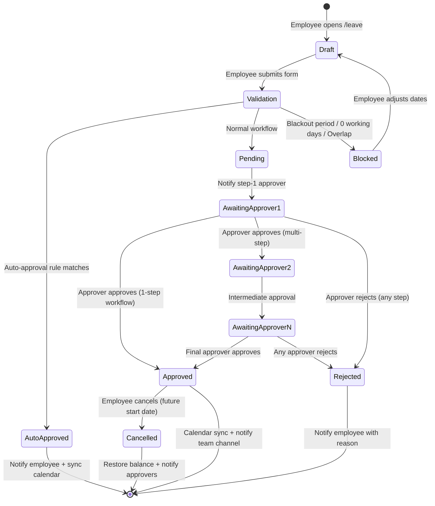
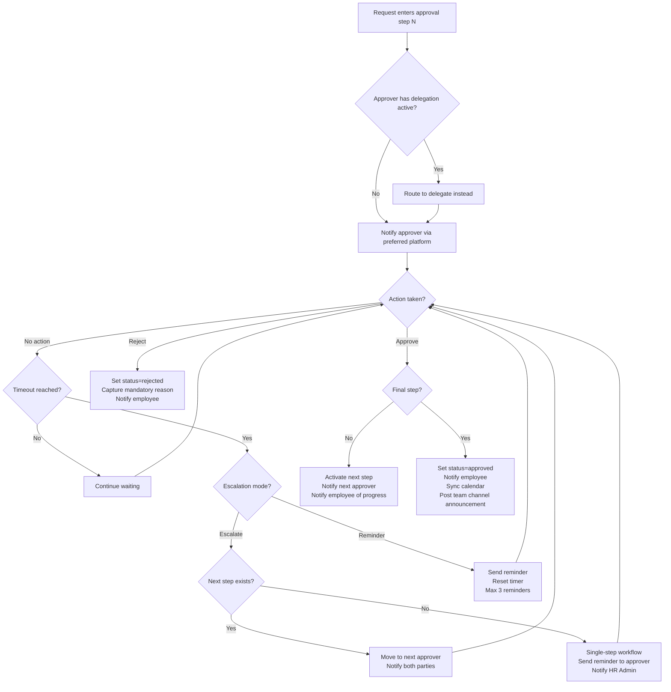
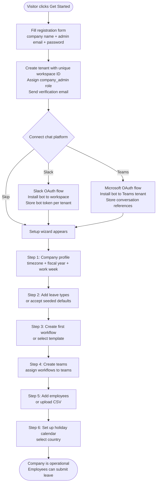
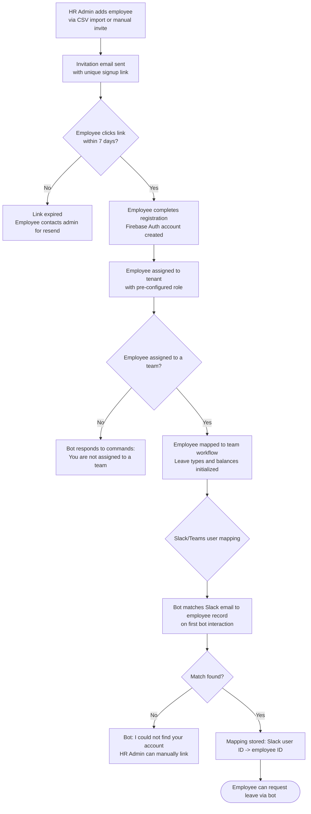
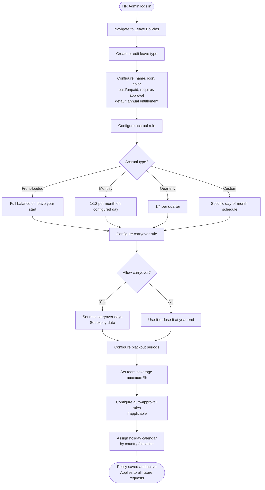
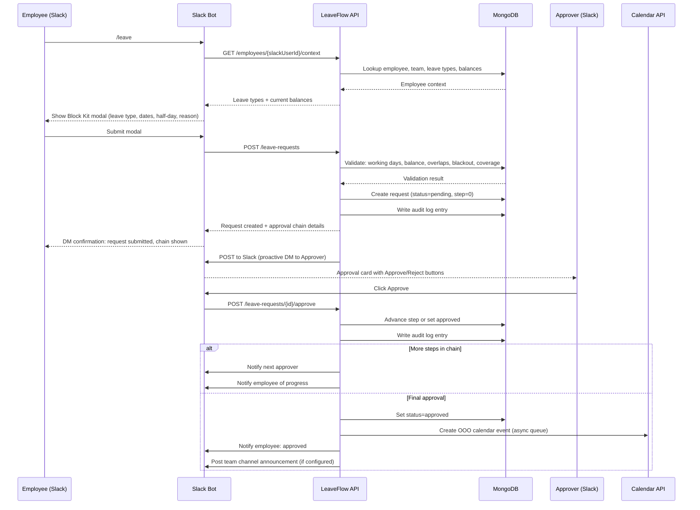
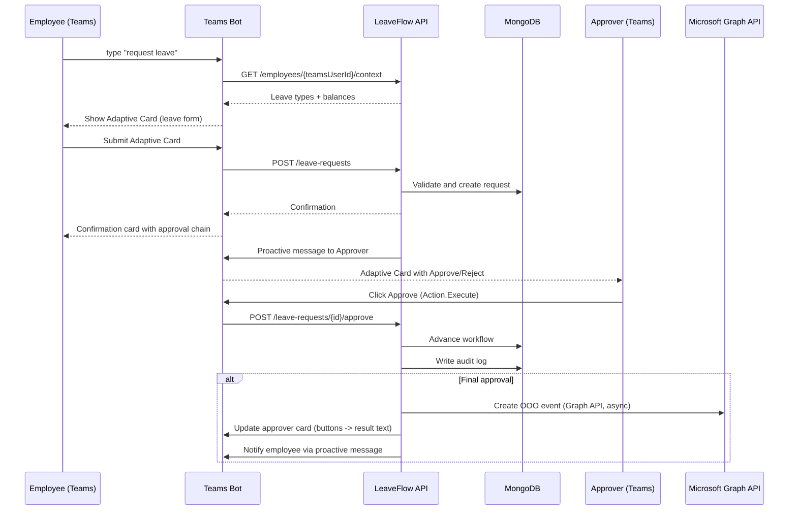
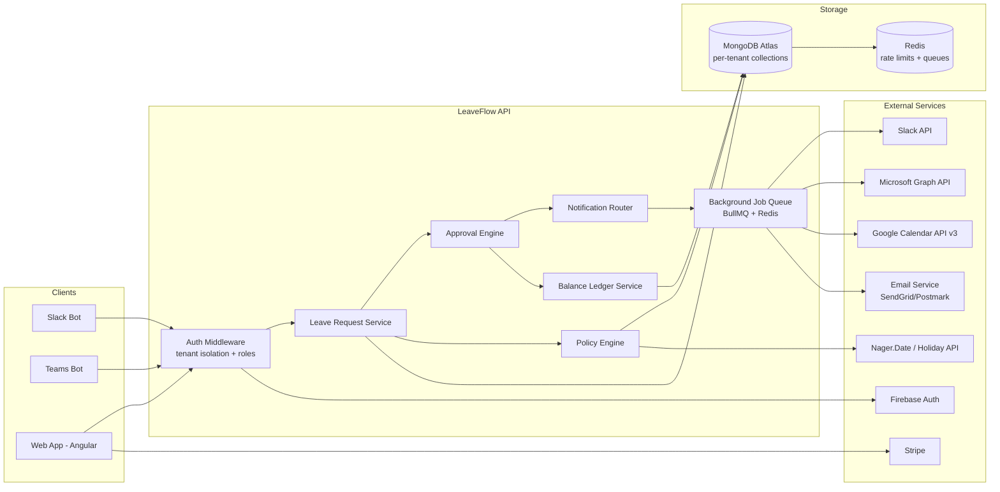

# Stage 3: Business Requirements Analysis — LeaveFlow

**Agent**: business-analyst
**Model**: sonnet
**Run**: 2026-03-16-disc-leave-bot
**Date**: 2026-03-16
**Input**: 01-vision.md, 02-stories.md, 02-stories-handoff.md, product-kb/features/leave-flow.md

---

## Table of Contents

1. [Executive Summary](#executive-summary)
2. [Stakeholders](#stakeholders)
3. [Process Flow Diagrams](#process-flow-diagrams)
4. [Business Rules Catalog](#business-rules-catalog)
5. [Gap Analysis](#gap-analysis)
6. [Traceability Matrix](#traceability-matrix)
7. [Risks and Dependencies](#risks-and-dependencies)
8. [Data Flow Overview](#data-flow-overview)
9. [Open Questions](#open-questions)

---

## Executive Summary

LeaveFlow is a greenfield SaaS leave management platform differentiating on three axes simultaneously: native chat-bot experience on both Slack and Teams, a configurable multi-level approval workflow engine, and a visual workflow builder accessible to non-technical managers. No current competitor combines all three.

The MVP is scoped to 50 user stories across 10 epics, targeting delivery in 4 months (8 x 2-week sprints). The core value chain is: **Employee submits leave via bot -> Approval engine routes through configured chain -> Approver acts from chat -> HR and calendar systems are updated**.

This Business Requirements Document validates that chain end-to-end, identifies the business rules required to implement it correctly, maps every requirement to its originating story, and surfaces infrastructure gaps, risks, and open questions that must be resolved before architecture begins.

---

## Stakeholders

| Stakeholder | Role | Key Concerns |
|-------------|------|--------------|
| Employee (P1) | Leave requester | Speed of submission, real-time status visibility, balance accuracy |
| Manager / Team Lead (P2) | Primary approver | One-click action, team availability context, zero context-switching |
| HR Administrator (P3) | Policy owner, compliance officer | Company-wide visibility, policy enforcement, audit trail, report generation |
| Department Head / Executive (P4) | Senior approver | Only see escalated/critical requests; delegation when OOO |
| Company Admin (P5) | System configurator | Quick onboarding (<30 min), platform connections, billing management |
| LeaveFlow (Internal) | Product & engineering | Freemium conversion, platform API compliance, GDPR, scalability |

---

## Process Flow Diagrams

### Diagram 1: Leave Request Lifecycle



### Diagram 2: Approval Workflow with Escalation



### Diagram 3: Company Onboarding Flow



### Diagram 4: Employee Onboarding Flow



### Diagram 5: HR Policy Configuration Flow



### Diagram 6: Slack Bot Interaction Flow



### Diagram 7: Teams Bot Interaction Flow



---

## Business Rules Catalog

### Validation Rules (Leave Request)

| ID | Rule | Condition | Action |
|----|------|-----------|--------|
| BR-001 | No zero-duration requests | Submitted leave spans 0 working days (all weekend/holiday) | Block submission with message: "Selected dates contain 0 working days." |
| BR-002 | No past-date requests | Start date is before today, except retroactive sick leave if policy allows | Block with message: "Start date cannot be in the past." (unless retroactive sick leave enabled) |
| BR-003 | No overlapping requests | Employee has a pending or approved request that overlaps new request dates | Block with message: "You have an overlapping request for [dates]." |
| BR-004 | No unassigned-team submission | Employee has no team assignment | Block all leave request commands; bot responds with HR contact prompt |
| BR-005 | No missing-workflow submission | Employee's team has no workflow assigned | Flag request for HR manual review; employee notified of delay |
| BR-006 | Balance warning on insufficient balance | Employee balance < requested days for that leave type | Show warning in modal but allow submission (unpaid fallback if policy permits); configurable per leave type |
| BR-007 | Half-day granularity only | Leave duration in hours (hourly leave not supported in MVP) | UI only offers full-day and half-day options; no hourly picker |
| BR-008 | Working days only | Weekends (as configured in company work week) and public holidays excluded from day count | Day count excludes non-working days automatically |
| BR-009 | Blackout period enforcement | Request dates overlap a configured blackout period affecting the employee's team and leave type | Block submission with blackout name and dates |
| BR-010 | Team coverage minimum | Approving request would drop team coverage below configured minimum | Auto-approval bypassed; routed to manual approval even if auto-approve rules apply |

### Approval Rules

| ID | Rule | Condition | Action |
|----|------|-----------|--------|
| BR-020 | No self-approval | The approver in a workflow step is the same user as the requester | Skip that step and escalate to the next step; notify HR of misconfiguration |
| BR-021 | Deactivated approver bypass | Approver in chain has been deactivated or removed | Skip that step; notify HR Admin of workflow misconfiguration |
| BR-022 | Rejection requires reason | Approver clicks Reject on any request | Show mandatory reason field (minimum 10 non-whitespace characters); block rejection without reason |
| BR-023 | Idempotent approval | Approver attempts to approve/reject an already-acted request | Return message: "You have already [approved/rejected] this request." No state change |
| BR-024 | Cancelled request blocks approval | Approver attempts to approve a request that the employee already cancelled | Return message: "This request was cancelled by the employee." No state change |
| BR-025 | Chain integrity | Any approver in the chain rejects | Immediately set status=rejected; skip all remaining steps; notify employee |
| BR-026 | Final step produces approval | Last approver in chain approves | Set status=approved; trigger downstream actions (calendar, notifications) |
| BR-027 | Auto-approval precedes workflow | Leave type has auto-approval rule matching request conditions (type, duration) | Skip approval chain; set status=auto-approved; audit log records policy name |
| BR-028 | Coverage check overrides auto-approval | Auto-approval conditions met but team coverage minimum would be violated | Route to manual approval workflow instead of auto-approving |
| BR-029 | Delegation active routing | Approver has active delegation for current date range | Route approval notification to delegate; original approver not notified |
| BR-030 | Expired delegation reverts | Delegation end date has passed | Route to original approver regardless of delegate setting |
| BR-031 | Force-approve bypasses chain | HR Admin uses Force Approve | Immediately set status=approved; skip remaining steps; audit log: "Force approved by HR Admin [name]" |
| BR-032 | Escalation timeout | Approver has not acted within configured timeout (default: 48 hours) | Escalate to next step OR send reminder (configurable); max 3 reminders before escalation |
| BR-033 | Single-step escalation | Escalation triggered but no next step exists | Send reminder to approver; notify HR Admin |

### Policy Rules

| ID | Rule | Condition | Action |
|----|------|-----------|--------|
| BR-040 | Working day calculation | Request spans dates | Count only days where: day-of-week is in company work week AND date is not a public/custom holiday |
| BR-041 | Timezone scoping | Employee timezone differs from company default | Leave dates interpreted in employee's local timezone |
| BR-042 | Fiscal year scoping | Fiscal year start month is configured | All balance calculations (accrual, carryover, year-end reset) use fiscal year, not calendar year |
| BR-043 | Accrual pro-ration | Mid-year hire with monthly accrual | Accrual starts from the first full month after hire date |
| BR-044 | Accrual fractional storage | Monthly accrual produces fractional days (e.g., 1.67) | Store to 2 decimal places; requests rounded to nearest 0.5 day |
| BR-045 | Carryover cap enforcement | Leave year ends; employee has unused days; carryover max is configured | Carry over up to max days; forfeit remainder; record in balance ledger |
| BR-046 | Carryover expiry enforcement | Carryover expiry date arrives | Reduce balance by remaining carryover days; record in audit log |
| BR-047 | Pro-rated entitlement for mid-year hire | Employee start date is mid-fiscal-year with front-loaded accrual | Entitlement = full_year_entitlement * (remaining_months / 12) |
| BR-048 | Work week change non-retroactive | Company work week configuration changes | Only future leave calculations use new work week; existing approved requests unaffected |
| BR-049 | Policy change non-retroactive | Accrual rule changes mid-year | Already-accrued balance preserved; future accruals use new rule |
| BR-050 | Holiday data fallback | External holiday API unavailable | Use cached copy; display admin warning with last-updated date |
| BR-051 | Holiday on weekend | Public holiday falls on a non-work day (e.g., Saturday) | Not counted as a leave holiday; no substitute day in MVP |
| BR-052 | Leave type deactivation | HR Admin deactivates a leave type | Existing pending requests continue through workflow; no new requests of that type accepted |
| BR-053 | Seeded leave types | New tenant created | System seeds: Vacation (paid, 20 days, requires approval), Sick Leave (paid, 10 days, requires approval), Personal (paid, 3 days, requires approval), Unpaid Leave (unpaid, unlimited, requires approval) |
| BR-054 | Negative balance warning | HR Admin adjusts balance below already-used amount | Warn admin: "Negative balance will be recorded." Allow with explicit confirmation |

### Notification Rules

| ID | Rule | Condition | Action |
|----|------|-----------|--------|
| BR-060 | Submission confirmation | Leave request successfully created | Employee receives DM confirmation with approval chain and request reference |
| BR-061 | Intermediate approval notification | Non-final approver approves | Employee notified of progress; next approver notified for action |
| BR-062 | Final approval notification | Final approver approves or auto-approval fires | Employee receives final approval DM; calendar sync triggered; team channel announcement posted (if configured) |
| BR-063 | Rejection notification | Any approver rejects | Employee receives rejection DM including full rejection reason |
| BR-064 | Cancellation notifications | Employee cancels approved future leave | All approvers who acted on the request notified of cancellation |
| BR-065 | Approver pending message update | Employee cancels request while it is pending with an approver | Approver's pending DM is updated to show "Request cancelled by employee"; buttons disabled |
| BR-066 | Channel announcement | Leave fully approved; team has announcement channel configured | Post to channel: "[Employee] will be on [type] leave from [start] to [end]." |
| BR-067 | Announcement on cancellation | Previously announced leave is cancelled | Post channel update: "[Employee]'s [type] leave for [dates] has been cancelled." |
| BR-068 | Email fallback | Approver not on Slack/Teams | Send email with request details and web app approve/reject links |
| BR-069 | Bot-absent fallback | Employee is offline when notification is triggered | Notification stored and delivered by the platform when employee comes back online |
| BR-070 | Escalation notification | Escalation triggered | Notify original approver that request was escalated; notify employee that escalation occurred |
| BR-071 | Stale approval alert | HR Admin views pending approvals; request >48 hours old | Badge request as "Stale"; allow HR Admin to send reminder to current approver |

### Billing Rules

| ID | Rule | Condition | Action |
|----|------|-----------|--------|
| BR-080 | Free tier user cap | Tenant on Free plan; Company Admin adds 11th user | Block action with upgrade prompt |
| BR-081 | Free tier workflow depth cap | Tenant on Free plan; HR Admin creates workflow with >1 step | Block with upgrade prompt |
| BR-082 | Free tier platform cap | Tenant on Free plan; already connected Slack; tries to connect Teams | Block with upgrade prompt |
| BR-083 | Free tier leave type cap | Tenant on Free plan; tries to add more than 1 custom leave type | Block additional types with upgrade prompt |
| BR-084 | Downgrade grace for users | Tenant downgrades; current user count exceeds Free tier limit | Existing users remain active; block adding new users until count drops below 10 |
| BR-085 | Payment failure grace period | Stripe payment fails | 7-day grace period before downgrade; admin email on days 1, 3, 7 |
| BR-086 | Data preservation on downgrade | Tenant downgrades to Free after payment failure | All historical data preserved; only feature restrictions apply |
| BR-087 | Per-seat proration | User count changes mid-billing-period | Next invoice prorated for added/removed seats |
| BR-088 | Subscription cancellation timing | Company Admin cancels subscription | Plan reverts to Free at end of current billing period; data retained |

### Access Control Rules

| ID | Rule | Condition | Action |
|----|------|-----------|--------|
| BR-090 | Tenant isolation | Any API request | Tenant ID from auth token must match tenant ID of all accessed resources; 403 on mismatch |
| BR-091 | Role-based route access | Request hits role-restricted endpoint | Check Firebase Auth custom claim for required role; 403 if insufficient |
| BR-092 | Employee data privacy | Employee views team calendar | Leave type of colleagues is hidden; only name and absence dates visible |
| BR-093 | Last-admin protection | Company Admin tries to remove themselves | Block if they are the only admin: "Assign another admin first." |
| BR-094 | Invitation expiry | Invitation link used after 7 days | Return expired message; admin must send new invitation |
| BR-095 | Session revocation on removal | User is removed from tenant | All active sessions invalidated; bot access revoked |
| BR-096 | HR override scope | HR Admin uses Force Approve/Reject or Revoke | Action recorded in audit log with HR Admin's identity; overrides normal workflow chain |

### Data Integrity Rules

| ID | Rule | Condition | Action |
|----|------|-----------|--------|
| BR-100 | Immutable audit log | Any audit log entry created | No update or delete operations permitted on audit collection |
| BR-101 | Balance ledger append-only | Balance changes (accrual, manual adjustment, leave deduction) | Each change creates a new ledger entry; no in-place mutation |
| BR-102 | Workflow version isolation | Workflow edited while requests are pending | Pending requests continue using workflow snapshot at time of submission; new requests use updated workflow |
| BR-103 | Team deletion cascade | Team is deleted | Members become unassigned (not deleted); pending requests flagged for HR review |
| BR-104 | Workflow deletion guard | Workflow has team assignments | Block deletion: "Remove all team assignments before deleting." |
| BR-105 | CSV import atomicity | CSV import with validation errors | Report all errors; do not partially commit (all rows succeed or all fail with error report) |
| BR-106 | CSV import deduplication | Duplicate email in CSV | Skip duplicate row; report row number in error summary |
| BR-107 | CSV team reference validation | CSV row references non-existent team | Row fails: "Team '[name]' not found."; rest of import continues |

---

## Gap Analysis

### Infrastructure Gaps (Must Be Built, Not in Stories)

| Gap | Description | Required By | Recommendation |
|-----|-------------|-------------|----------------|
| Multi-tenancy middleware | Every API request must enforce tenant ID scoping. Not explicitly designed as infrastructure in any story. | All epics | Design tenant isolation as an Express middleware layer applied globally. Include in LF-005 scope. |
| Bot platform abstraction layer | Slack and Teams have fundamentally different APIs (Block Kit vs. Adaptive Cards, slash commands vs. message commands, Bolt SDK vs. Bot Framework). A shared business logic service layer is referenced in LF-018 technical notes but not designed as a standalone component. | E2, E3 | Define a `BotAdapter` interface with Slack and Teams implementations. The core leave request, approval, and notification logic must call the adapter, not platform APIs directly. This is architectural — must be resolved before Sprint 1. |
| Background job infrastructure | Accrual (monthly), escalation timeout (every 15 min), calendar sync queue, and email retry all require background processing. No story defines the scheduler/worker infrastructure. | LF-024, LF-032, LF-060, LF-061, LF-073 | Decide on job infrastructure: Bull/BullMQ with Redis queues (recommended) or cron-based scheduler. Design in Sprint 1; implement in Sprint 5. |
| Notification delivery service | The notification layer spans DMs, channel posts, emails, and future webhooks. No single story owns the notification router. | E9 | Create a `NotificationService` that accepts events and routes to: Slack DM / Teams proactive message / Email (if platform unavailable). This is a cross-cutting service, not a feature story. |
| Database schema and indices | MongoDB collections for: tenants, users, employees, teams, workflows, leave-requests, leave-types, balances, balance-ledger, audit-log, holiday-calendars, bot-mappings, billing. No story defines index strategy for multi-tenant queries. | All epics | Database schema design is a prerequisite for Sprint 1. Performance queries (pending by approver, balance by employee, calendar by date range) need compound indices including tenantId. |
| Token management / secret rotation | Slack bot tokens, Teams bot credentials, Google Calendar refresh tokens, Microsoft Graph tokens, Stripe keys all require encrypted storage and rotation strategy. Referenced in technical notes but not owned by any story. | E2, E3, E8, E10 | Define a `SecretsService` for encrypted token storage (AES-256 with per-tenant encryption keys or a KMS). Include in Sprint 1 scope as an architectural requirement. |
| Rate limiting infrastructure | LF-005 defines API-level rate limiting. Slack API imposes its own rate limits (Tier 1-4 based on method). Teams Graph API also has throttling. No story defines the outbound rate limit management. | E2, E3, E7 | Implement an outbound queue for Slack/Teams API calls with retry and backoff. This prevents bot operations from failing during high-volume periods. |
| i18n string infrastructure | PO decision: English-only at MVP but i18n-ready string format from day 1. No story explicitly defines the string externalization pattern. | All UI | All user-facing strings (bot messages, web UI labels, email templates) must use a localization key structure (e.g., `t('bot.leave_request.submitted')`) from day 1. Establish convention in Sprint 1. |

### Third-Party Service Dependencies

| Service | Purpose | Required Stories | Risks |
|---------|---------|-----------------|-------|
| Slack API + Bolt SDK | Bot interactions, slash commands, interactive messages, proactive DMs | E2 | App Directory review 2-4 weeks; must submit before Sprint 1 ends |
| Microsoft Bot Framework + Graph API | Teams bot, Adaptive Cards, proactive messaging, Outlook calendar | E3, LF-061 | Teams App Store review 2-6 weeks; must submit before Sprint 1 ends |
| Firebase Authentication | User auth, custom claims (roles), token verification | E1 | Separate projects required for staging/production (per platform config) |
| MongoDB Atlas | Primary data store; multi-tenant collections | All | Index design critical for query performance at scale |
| Stripe Billing | Subscription management, per-seat pricing, invoices, webhook events | E10 | Stripe account + products/prices configured before Sprint 7; test mode from Sprint 1 |
| Google Calendar API v3 | OOO event creation/deletion on approval | LF-060 | OAuth consent screen requires Google verification for production scopes |
| Microsoft Graph API | Outlook calendar OOO events; shared with Teams OAuth | LF-061 | Covered by Teams OAuth scope extension |
| Nager.Date API (or alternative) | Public holiday data for 50+ countries | LF-033 | Free tier rate limits; evaluate Calendarific ($) and AbstractAPI ($) for production reliability |
| Transactional Email (SendGrid / Postmark / AWS SES) | Email fallback notifications, invitation emails, billing alerts | LF-073, LF-001, LF-081 | Select provider and configure DNS (SPF/DKIM) before Sprint 1 to avoid spam delivery issues |
| Redis | Rate limiting, background job queues (BullMQ), ephemeral caching | LF-005, background infra | Not mentioned in stack but implied by technical notes; must be provisioned |

### Domain Knowledge Gaps

| Gap | Impact | Recommendation |
|-----|--------|----------------|
| Labor law per country | Leave entitlements, carryover rules, and minimum paid leave days are legally mandated in many jurisdictions (e.g., EU Working Time Directive, UK statutory leave, French RTT). LeaveFlow's policies are user-configured with no guardrails. | Add a disclaimer: "LeaveFlow does not provide legal advice. Ensure your leave policies comply with local labor law." Consider displaying statutory minimums as reference data in a future Phase. |
| Holiday calendar accuracy | Public holiday data quality varies by country/region. Some countries have state/province-level holidays (US, Australia, India). | Choose Nager.Date for MVP (covers national holidays). Document limitation: sub-national holidays not supported in MVP. Add it as a Phase 2 item. |
| GDPR data subject rights | Employees have rights to access, correct, and delete personal data. The immutable audit log (BR-100) conflicts with the right to erasure for PII in the audit trail. | Legal review required. Strategy: pseudonymize employee identifiers in audit log on erasure request rather than deleting entries. This preserves audit integrity while complying with GDPR. No story currently covers this. **This is a P0 gap.** |
| Part-time employee entitlement | PO decision: handled via manual balance adjustment. Many countries legally require pro-rated entitlement for part-time workers. | Document as a known limitation. Add "FTE factor" field to employee profile as a Phase 2 item. |

---

## Traceability Matrix

| Req ID | Functional Requirement | User Story | Acceptance Criteria Summary | Priority |
|--------|----------------------|------------|----------------------------|----------|
| FR-1.1 | Slash command /leave | LF-011 | /leave opens Block Kit modal with all fields | Must Have |
| FR-1.2 | Leave request form fields | LF-011, LF-018 | Modal has: type, start, end, half-day, reason | Must Have |
| FR-1.3 | Submission confirmation with chain | LF-011, LF-018 | Bot DM shows approval chain after submission | Must Have |
| FR-1.4 | Balance check command | LF-012, LF-019 | /leave balance returns ephemeral table per type | Must Have |
| FR-1.5 | Status check command | LF-013, LF-019 | /leave status shows recent 5 with chain progress | Must Have |
| FR-1.6 | Status change DM notifications | LF-070, LF-071 | Employee DM on every lifecycle state change | Must Have |
| FR-1.7 | Cancel pending/approved leave | LF-014 | /leave cancel shows dropdown; confirms and restores balance | Must Have |
| FR-2.1 | Sequential approval chains | LF-020 | Engine routes steps in order; tracks current_step | Must Have |
| FR-2.2 | Approver types | LF-021 | Step can be: specific user or role:direct_manager | Must Have |
| FR-2.3 | Conditional branching | NOT IN MVP | Flagged as Phase 2 | Phase 2 |
| FR-2.4 | Parallel approval paths | NOT IN MVP | Flagged as Phase 2 | Phase 2 |
| FR-2.5 | Auto-approval rules | LF-023 | HR configures auto-approve by type/duration | Should Have |
| FR-2.6 | Auto-escalation on timeout | LF-024 | Configurable timeout per step; escalate or remind | Could Have |
| FR-2.7 | Delegation | LF-025 | Manager sets delegate with date range | Could Have |
| FR-2.8 | One-click approve/reject from chat | LF-015, LF-019B | Approve/Reject buttons in DM/card | Must Have |
| FR-2.9 | Reject with mandatory reason | LF-026 | Modal required; min 10 chars; shown to employee | Must Have |
| FR-3.1 | Visual drag-and-drop builder | NOT IN MVP | Phase 2 | Phase 2 |
| FR-3.2 | Workflow templates | LF-022 | 3 pre-built templates selectable on creation | Should Have |
| FR-3.3 | Conditional nodes | NOT IN MVP | Phase 2 | Phase 2 |
| FR-3.4 | Workflow test mode | NOT IN MVP | Phase 2 (no story exists) | Phase 2 |
| FR-3.5 | Workflow version history | NOT IN MVP | Phase 2 (no story exists) | Phase 2 |
| FR-3.6 | Team-to-workflow assignment | LF-040 | Team creation includes workflow assignment | Must Have |
| FR-3.7 | Clone workflow | LF-021 | Clone creates copy with "(Copy)" suffix | Must Have |
| FR-4.1 | Custom leave types | LF-030 | HR Admin creates types with all properties | Must Have |
| FR-4.2 | Accrual rules | LF-032 | Front-loaded, monthly, quarterly, custom | Must Have |
| FR-4.3 | Carryover rules | LF-034 | Max days + expiry configurable per type | Should Have |
| FR-4.4 | Public holiday calendars | LF-033 | Country-based auto-populate; custom holidays | Must Have |
| FR-4.5 | Blackout periods | LF-035 | Dates when leave cannot be requested | Could Have |
| FR-4.6 | Team coverage rules | LF-010 (partial), LF-023 (partial) | Coverage minimum blocks auto-approval | Gap — no dedicated story |
| FR-4.7 | Probation period support | NOT IN MVP | No story; Phase 2 | Phase 2 |
| FR-5.1 | Absence calendar | LF-050 | Monthly calendar with filters | Must Have |
| FR-5.2 | Pending approvals with bottleneck detection | LF-051 | Sorted by age; stale badge; reminder button | Must Have |
| FR-5.3 | Leave balance report | LF-052 | Table + CSV + PDF export | Must Have |
| FR-5.4 | Absence trend analytics | NOT IN MVP | No story; Phase 2 | Phase 2 |
| FR-5.5 | Export CSV/PDF | LF-052 | Both formats for balance report | Must Have |
| FR-5.6 | Audit trail | LF-053 | Immutable chronological log; filterable | Must Have |
| FR-5.7 | Configurable alerts | NOT IN MVP | No story (e.g., "60+ days no leave") | Phase 2 |
| FR-6.1 | Bulk import via CSV | LF-041 | CSV template; import with error report | Must Have |
| FR-6.2 | Employee-to-team mapping | LF-040, LF-044 | Teams with workflows; Slack mapping | Must Have |
| FR-6.3 | SSO / SAML / OIDC | NOT IN MVP | Phase 2 | Phase 2 |
| FR-6.4 | Employee self-service portal | LF-042 | Balance, history, team calendar | Must Have |
| FR-6.5 | Manager view | LF-043 | Team overview, calendar, pending approvals | Must Have |
| FR-7.1 | Google Calendar sync | LF-060 | OOO events on approval; delete on cancel | Should Have |
| FR-7.2 | HRIS connectors | NOT IN MVP | Phase 2 | Phase 2 |
| FR-7.3 | Payroll export | NOT IN MVP | Phase 3 | Phase 3 |
| FR-7.4 | Webhook/API | NOT IN MVP | Phase 3 | Phase 3 |
| NFR-1 | Bot response <2 seconds | LF-005, LF-011, LF-018 | API performance targets; rate limiting | Must Have |
| NFR-2 | 99.9% uptime | Infrastructure | Not covered by any story — ops requirement | Must Have |
| NFR-3 | SOC 2 / GDPR | LF-053 (audit), LF-005 (security) | GDPR erasure not covered — P0 gap | Must Have |
| NFR-4 | 5-10,000 employees | LF-005, DB design | Index design + pagination everywhere | Must Have |
| NFR-5 | Multi-tenancy | LF-001, LF-005 | Tenant ID isolation on all resources | Must Have |
| NFR-9 | Immutable audit log | LF-053 | Append-only MongoDB collection | Must Have |

---

## Risks and Dependencies

### Technical Risks

| Risk | Likelihood | Impact | Mitigation |
|------|-----------|--------|------------|
| Slack/Teams App Store review delays (2-6 weeks) | High | High — blocks all bot stories | Submit apps during Sprint 1. Use enterprise-level test installations while review is in progress. Stagger releases: Slack first (shorter review), Teams second. |
| Slack API interactive message expiry (30 days) | Medium | Medium — approvals via old messages fail | Implement web app fallback for all approval actions. Include "View in web app" link on all approval messages. |
| Teams proactive messaging requires stored conversation references | High | High — Teams approver notifications fail if references not stored | Store Teams conversation reference on every user's first bot interaction. Design this as a first-class data entity, not an afterthought. |
| Google Calendar OAuth consent screen requires Google verification | Medium | Medium — consumer accounts blocked until verified | Use Google Workspace domain restriction initially (B2B customers likely have Workspace). Submit for verification in Sprint 7. |
| Nager.Date API reliability | Medium | Medium — holiday data unavailable | Implement local cache with annual refresh. Fallback to cached data with admin warning. Evaluate paid alternatives before Sprint 6. |
| Redis/BullMQ complexity | Low | Medium — background jobs unreliable | Use managed Redis (Railway Redis add-on or Upstash). Design job schema carefully to avoid data loss on restart. |
| Bot response time >2 seconds | Medium | High — core NFR violated | The 2-second target requires: bot handler returns acknowledgement immediately; heavy processing runs async. Implement ack-then-process pattern for all bot commands. |
| Multi-tenant data leak | Low | Critical — GDPR/trust breach | Every MongoDB query MUST include tenantId filter. Add automated test that verifies tenant isolation on every API endpoint. |

### Business Risks

| Risk | Likelihood | Impact | Mitigation |
|------|-----------|--------|------------|
| Low free-to-paid conversion (<8%) | Medium | High — revenue model fails | Design upgrade prompts at natural friction points (hitting limits). Track conversion funnel from day 1. |
| Competitor adds visual workflow builder before Phase 2 | Medium | Medium — differentiator eroded | Accelerate Phase 2 planning. Ensure form-based builder in MVP is genuinely usable, not a degraded experience. |
| GDPR non-compliance at launch | Low | Critical — regulatory fines, customer loss | Legal review of data model before MVP launch. Implement GDPR data subject request handling (access, erasure with pseudonymization) as a pre-launch requirement. |
| Platform policy changes (Slack/Teams) | Low | High — core functionality broken | Abstract platform layer (BotAdapter) minimizes blast radius. Monitor platform changelogs. |
| Pricing pressure | High | Medium — below-cost pricing to compete | Free tier is acquisition, not a revenue line. Team plan at $2/user must be profitable. Monitor unit economics after 50 paid companies. |

### Epic Dependencies (Build Order)

```
E1 (Foundation) — Must be first; everything depends on it
  └── E2 (Slack Bot)
  │     └── E6 (Team/Employee Management)
  │           └── E4 (Approval Engine)
  │                 └── E9 (Notifications)
  │                       └── E8 (Calendar Integrations)
  └── E3 (Teams Bot) — parallel with E2 from Sprint 3
  └── E5 (Policy Management) — parallel with E2 from Sprint 2
  └── E7 (HR Dashboard) — requires E4, E5, E6
  └── E10 (Billing) — independent after E1; integrate in Sprint 7
```

**Critical Path**: E1 -> E6 -> E4 -> E2 -> E9

Sprint 3 is the highest-risk sprint: it simultaneously introduces E6 (team mapping), E4 (approval engine), and the first complete E2 story (LF-011). Any delay in LF-040 (team mapping) blocks LF-011 (leave submission). This must be addressed in sprint planning.

---

## Data Flow Overview

### Component Data Flow



### Key Data Flows

**Leave Request Submission:**
Bot -> API (auth + tenant isolation) -> Validate via Policy Engine (working days, balance, blackout, overlap) -> Create request in MongoDB -> Write audit log -> Push approval task to job queue -> Job queue notifies approver via Slack/Teams

**Approval Action:**
Approver (Slack/Teams) -> Bot -> API -> Approval Engine (advance state machine) -> Write audit log -> If final: update request status, push calendar sync task to queue, push notifications to queue -> Queue delivers DM notifications, calendar events, channel posts

**Accrual Run (background):**
Monthly cron job -> Fetch all active tenants -> For each tenant, fetch all employees with accrual-based leave types -> Calculate accrual amount per employee -> Append to balance ledger -> Notify none (silent operation)

**Escalation Check (background):**
Every-15-min job -> Query requests where status=pending AND current_step_deadline < now -> For each overdue request: escalate or remind per workflow step config -> Write audit log -> Notify via job queue

### Tenant-Specific vs. Shared Data

| Data | Tenancy | Notes |
|------|---------|-------|
| Leave requests | Per-tenant | tenantId on every document; never cross-tenant queries |
| Employees, teams, workflows | Per-tenant | Same isolation |
| Leave types, policies | Per-tenant | HR Admin configures per company |
| Balance ledger | Per-tenant | Per employee per leave type |
| Audit log | Per-tenant | Filtered by tenantId |
| Bot mappings (Slack/Teams user -> employee) | Per-tenant | slackTeamId scopes to tenant |
| Holiday calendars (country data) | Shared + per-tenant overlay | Nager.Date data cached globally; custom company holidays per tenant |
| Billing / subscription | Per-tenant | Stripe customer ID per tenant |
| Firebase Auth users | Shared Firebase project | Custom claim stores tenantId; API enforces isolation |

### PII Data Map

| PII Field | Collection | Retention | GDPR Consideration |
|-----------|-----------|-----------|-------------------|
| Employee name, email | employees | Active employment + 2 years | Erasure: pseudonymize on request |
| Leave request dates and type | leave_requests | 5 years (compliance) | Erasure: detach from employee record; keep anonymized aggregate |
| Rejection reasons | leave_requests | 5 years | May contain personal details; treat as PII |
| Audit log actor + actions | audit_log | 7 years (compliance) | Cannot delete; pseudonymize employee reference on erasure request |
| Slack/Teams user IDs | bot_mappings | Active + 30 days post-deletion | Delete mapping on employee removal |
| Calendar OAuth tokens | employee_integrations | Active only | Delete on disconnect or employee removal; encrypted at rest |
| Stripe payment data | External (Stripe) | Stripe-managed | LeaveFlow stores only: customer ID, subscription ID |
| IP addresses (sessions) | auth logs | 90 days | Pseudonymize after 30 days |

---

## Open Questions

| # | Question | Impact | Proposed Answer | Owner |
|---|----------|--------|-----------------|-------|
| OQ-1 | GDPR right-to-erasure vs. immutable audit log: what is the specific legal strategy? | P0 — blocker for GDPR compliance at launch | Pseudonymize: replace employee_id in audit log with a hash on erasure request; preserve action records without personal identifiers. Requires legal validation. | Legal + CTO |
| OQ-2 | Holiday API: Nager.Date (free) vs. Calendarific / AbstractAPI (paid)? | Affects LF-033 reliability | Use Nager.Date with local caching for MVP; plan to migrate to a paid tier if rate limits are hit in production. Evaluate at 50+ companies. | Tech Lead |
| OQ-3 | What happens when a Teams user uses both Slack and Teams at the same tenant? Which platform gets approver notifications? | Affects LF-071 behavior | Define a per-user "primary platform" preference. Default: platform where the bot was first connected for the tenant. Configurable by user in Settings. No story covers this — needs a new AC in LF-071. | Product Owner |
| OQ-4 | Team coverage minimum rule (FR-4.6): which story owns this? No dedicated story exists. | Coverage enforcement is a key safety feature referenced in BR-010 and BR-028 | Add to LF-021 (workflow config) or create a new story LF-036 in Epic E5. Decision needed before Sprint 2. | Product Owner |
| OQ-5 | Background job infrastructure: Railway cron jobs vs. BullMQ with Redis vs. a managed scheduler? | Affects LF-024, LF-032, accrual, calendar sync reliability | Recommend BullMQ + Railway Redis add-on: gives retry, dead-letter queue, visibility. Simple cron is insufficient for calendar sync and escalation reliability. | CTO / Architect |
| OQ-6 | What is the team size assumption for sprint capacity? The PO flagged this but left it for BA validation. | Affects feasibility of 8-sprint plan | With a 4-person team (2 BE, 1 FE, 1 QA), the sprint plan is aggressive for S3 and S7. Recommend identifying 3 Could-Have stories that can slip to Phase 2 if needed. | Scrum Master |
| OQ-7 | When does UX/UI design start? Stories LF-003, LF-042, LF-043, LF-050-055 need mockups before development. | Blocks Sprint 6 FE stories if design is late | UX/UI design should begin in Sprint 1 (running parallel to backend foundation). Handoff mockups by Sprint 3 for all web stories. | UX/UI Expert |
| OQ-8 | Should the "team coverage minimum" (FR-4.6) apply at request submission time, at approval time, or both? | Affects business rule BR-010 and LF-023 | Recommend: check at submission (warn), check again at final approval (enforce). Provides employee feedback early and enforces at decision point. | Product Owner |
| OQ-9 | Stripe test account setup timeline: must be ready before Sprint 7. When does ops provision this? | Blocks LF-080 and LF-081 | Provision Stripe account and configure Products/Prices ($2/user/month per-seat subscription) by end of Sprint 2. | Company Admin / Ops |
| OQ-10 | Should Teams user-to-employee mapping work the same way as Slack (LF-044)? There is no Teams equivalent of LF-044 in the stories. | Missing story for Teams platform | Create LF-045: Teams User-to-Employee Mapping (mirror of LF-044 for Teams), or extend LF-044 to cover both platforms. Without this, Teams approver notifications cannot be routed. P0 for platform parity. | Product Owner |

---

## Appendix: Story Coverage by Component

### API Endpoints Required (Sprint 1-3 priority)

| Endpoint | Method | Story | Sprint |
|----------|--------|-------|--------|
| /tenants | POST | LF-001 | S1 |
| /auth/token-verify | POST | LF-002 | S1 |
| /tenants/{id}/settings | GET, PUT | LF-004 | S2 |
| /slack/oauth/callback | GET | LF-010 | S2 |
| /teams/oauth/callback | GET | LF-017 | S2 |
| /leave-types | GET, POST, PUT, DELETE | LF-030 | S2 |
| /workflows | GET, POST, PUT, DELETE | LF-021 | S2 |
| /teams | GET, POST, PUT, DELETE | LF-040 | S3 |
| /employees | GET, POST, PUT | LF-041, LF-002 | S3 |
| /employees/{id}/slack-mapping | POST | LF-044 | S3 |
| /leave-requests | GET, POST | LF-011, LF-018 | S3 |
| /leave-requests/{id}/approve | POST | LF-015, LF-019B | S4 |
| /leave-requests/{id}/reject | POST | LF-026 | S5 |
| /leave-requests/{id}/cancel | POST | LF-014 | S5 |
| /employees/{id}/balances | GET, PUT | LF-031 | S5 |
| /slack/interactions | POST | LF-015 (webhooks) | S3 |
| /teams/activities | POST | LF-019B (webhooks) | S4 |

### Definition of Done Reference

All stories must meet the following before sprint close:
- Unit tests with 80%+ coverage on business logic
- Integration tests for all API endpoints
- Tenant isolation verified by automated test
- Audit log entry verified for all state-changing operations
- Performance test: bot response under 2 seconds under simulated load
- GDPR fields identified and documented in data dictionary
